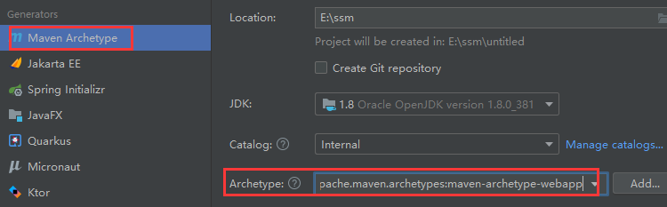
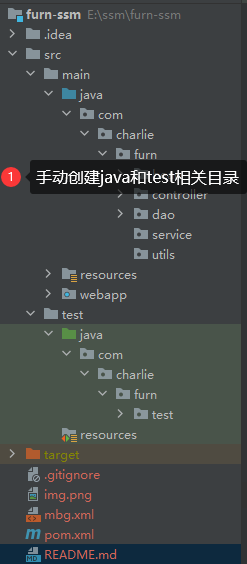
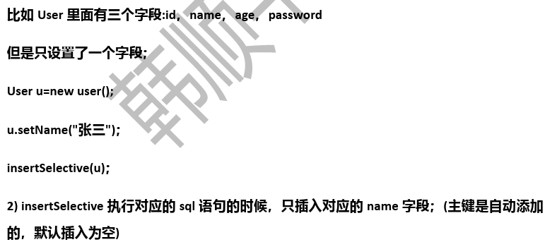
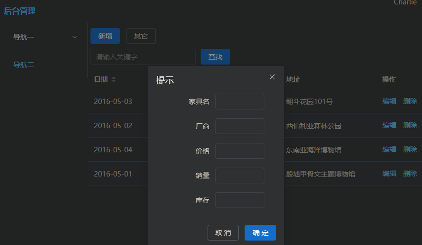

# SSM(Vue3+ElementPlus+Axios+SSM前后端分离)

## 项目介绍

| 技术栈    |                               |
|--------|-------------------------------|
| 前端框架   | Vue                           |
| 后台框架   | SSM(SpringMVC+Spring+MyBatis) |
| 数据库    | MySQL                         |
| 项目依赖管理 | Maven                         |
| 分页     | pagehelper                    |
| 逆向工程   | MyBatis Generator             |

### 项目基础环境搭建

1. 创建项目：
   1) 
   2) 
   3) 引入项目依赖的[jar包](pom.xml)，**先引入基本的包**，开发中，需要什么包再导入即可
   4) 给项目配置tomcat，方式同JavaWeb
   5) 启动tomcat，完成测试
2. [项目全局配置](src/main/webapp/WEB-INF/web.xml)
   1) 配置启动Spring容器
   2) 配置SpringMVC分发控制器
   3) 配置字符编码过滤器
   4) 配置HiddenHttpMethodsFilter，使用Rest风格的URI
3. 完成[SpringMVC配置](src/main/webapp/WEB-INF/springDispatcherServlet-servlet.xml)
   1) **创建SpringMVC的配置文件，主要包含网站跳转逻辑的控制**
   2) 配置扫描控制器所在包
   3) 配置视图解析器
   4) 两个常规配置
4. 配置[Spring](src/main/resources/applicationContext.xml)和[MyBatis](src/main/resources/mybatis-config.xml)并完成整合
   1) **Spring的配置文件 `applicationContext.xml`：主要配置和业务逻辑有关的，比如数据源、事务控制等**
   2) 配置扫描除控制外的所有包
   3) 引入外部[jdbc.properties文件](src/main/resources/jdbc.properties)，配置数据源
   4) 配置spring和mybatis整合
   5) 配置扫描器，将mybatis接口的实现类放入到ioc容器中
   6) 配置事务管理对象
   7) 配置启用基于注解的声明式事务管理器(使用XML配置+切入表达式)
5. 创建表，使用逆向工程生成Bean、XxxMapper和XxxMapper.xml
   1) 创建 `furn_ssm` 数据库和 `furn` 表
   2) 使用MyBatis Generator逆向工程生成bean mapper接口和mapper.xml。_建议：如果在开发中，逆向工程生成的代码，不能满足需要，再自己编写_
   3) 配置[mbg.xml](mbg.xml)，直接放在项目目录下面，在配置模板xml文件上修改即可

```mysql
# 创建 furn_ssm 数据库
CREATE DATABASE IF NOT EXISTS `furn_ssm`;
USE `furn_ssm`;
-- 创建家具表
CREATE TABLE `furn` (
 `id` INT(11) PRIMARY KEY AUTO_INCREMENT, -- id
 `name` VARCHAR(64) NOT NULL,		  -- 家具名
 `maker` VARCHAR(64) NOT NULL,		  -- 制造商
 `price` DECIMAL(11, 2) NOT NULL,	  -- 价格
 `sales` INT(11) NOT NULL,		  -- 销量
 `stock` INT(11) NOT NULL,		  -- 库存
 `img_path` VARCHAR(256) NOT NULL	  -- 图片路径
)CHARSET=utf8;
-- 初始化家具数据
INSERT INTO `furn`(`id`, `name`, `maker`, `price`, `sales`, `stock`, `img_path`) VALUES 
	(NULL, '北欧风格小桌子', '熊猫家居', 180, 666, 7, 'assets/images/product-image/1.jpg'),
	(NULL, '西伯利亚土豆盆栽', '慈恩家具', 260, 193, 7, 'assets/images/product-image/2.jpg'),
	(NULL, '神龙大侠沙发', '阿宝家具', 1000, 23, 17, 'assets/images/product-image/3.jpg'),
	(NULL, '典雅风格小台灯', '蚂蚁家具', 56, 1023, 7, 'assets/images/product-image/4.jpg'),
	(NULL, '简约风格小椅子', '熊猫家居', 180, 666, 7, 'assets/images/product-image/5.jpg'),
	(NULL, '温馨风格鱼缸造景', '自然世界', 1560, 9, 11, 'assets/images/product-image/6.jpg'),
	(NULL, '豪华衣柜', '至尊熊猫', 888, 123, 17, 'assets/images/product-image/7.jpg');
-- 结果
SELECT * FROM `furn`;
```

```java
package com.charlie.furn.test;

import org.junit.Test;
import org.mybatis.generator.api.MyBatisGenerator;
import org.mybatis.generator.config.Configuration;
import org.mybatis.generator.config.xml.ConfigurationParser;
import org.mybatis.generator.internal.DefaultShellCallback;

import java.io.File;
import java.util.ArrayList;
import java.util.List;

// 官方测试代码
public class MBGTest {
    @Test
    public void generator() throws Exception {
        List<String> warnings = new ArrayList<String>();
        boolean overwrite = true;
        // 这里要指定你自己配置的mbg.xml
        // 如果这样访问，需要将文件放在项目下
        File configFile = new File("mbg.xml");
        ConfigurationParser cp = new ConfigurationParser(warnings);
        Configuration config = cp.parseConfiguration(configFile);
        DefaultShellCallback callback = new DefaultShellCallback(overwrite);
        MyBatisGenerator myBatisGenerator = new MyBatisGenerator(config, callback, warnings);
        myBatisGenerator.generate(null);
    }
}
```

```java
package com.charlie.furn.test;

import com.charlie.furn.bean.Furn;
import com.charlie.furn.dao.FurnMapper;
import org.junit.Before;
import org.junit.Test;
import org.springframework.context.ApplicationContext;
import org.springframework.context.support.ClassPathXmlApplicationContext;

import java.math.BigDecimal;

public class FurnMapperTest {

    private FurnMapper furnMapper;

    @Before
    public void init() {
        // 1. 获取到容器
        ApplicationContext ioc = new ClassPathXmlApplicationContext("applicationContext.xml");
        // 2. 获取到FurnMapper
        furnMapper = ioc.getBean(FurnMapper.class);
        System.out.println("furnMapper=" + furnMapper.getClass());  // class com.sun.proxy.$Proxy17
    }

    @Test
    public void insertSelective() {
        // 3. 添加数据
        Furn furn = new Furn(null, "人体工学椅", "西昊", new BigDecimal("560.5"), 260, 140, "assets/images/product-image/8.jpg");
        int affected = furnMapper.insertSelective(furn);
        System.out.println("affected=" + affected);
        System.out.println("OK!");
    }

    @Test
    public void deleteByPrimaryKey() {
        // 根据id，删除数据
        int affected = furnMapper.deleteByPrimaryKey(3);
        System.out.println("affected=" + affected);
        System.out.println("OK!");
    }

    @Test
    public void updateByPrimaryKey() {
        Furn furn = new Furn();
        furn.setId(7);
        furn.setName("朴实无华大衣柜");

        // 会修改所有的字段，如果没有设置字段对应的属性，那么默认是null，然而数据库表字段设置 not null，所以会报错
        //furnMapper.updateByPrimaryKey();

        // updateByPrimaryKeySelective 根据对象属性值修改数据，只修改非null属性值对应的字段
        // 其它方法都是类似的
        int affected = furnMapper.updateByPrimaryKeySelective(furn);
        System.out.println("affected=" + affected);
        System.out.println("OK!");
    }

    @Test
    public void selectByPrimaryKey() {
        Furn furn = furnMapper.selectByPrimaryKey(1);
        System.out.println("furn=" + furn);
        System.out.println("OK!");
    }
}
```

### 注意事项和细节说明

1. `insertSelective` 和 `insert` 的区别
   1) insertSelective选择性保存数据
   2) 
   3) 而insert则是不论设置多少个字段，统一都要添加，即使该字段值为null。这样可能导致报错，因为数据库中设置了 `not null`

## 1-Vue搭建前端页面

- 

## 2-添加家具信息

1. 完成后台代码从dao->service->controller，并对每层代码进行测试，到controller曾，使用Postman发送http的post请求完成测试
2. 完成前端代码，使用axios发送ajax(json数据)给后台，实现添加家具家具信息

```java
package com.charlie.furn.bean;

import org.springframework.util.StringUtils;
import java.math.BigDecimal;

public class Furn {
    private Integer id;
    private String name;
    private String maker;
    private BigDecimal price;
    private Integer sales;
    private Integer stock;

    // 当创建Furn对象 imgPath 为null时，imgPath给默认值(默认图片路径)
    private String imgPath = "assets/images/product-image/1.jpg";

    public Furn() {}

    public Furn(Integer id, String name, String maker, BigDecimal price, Integer sales, Integer stock, String imgPath) {
        this.id = id;
        this.name = name;
        this.maker = maker;
        this.price = price;
        this.sales = sales;
        this.stock = stock;
        // 如果imgPath不为null，而且是有数据的，就设置 this.imgPath，否则就使用默认值
        // imgPath != null && !imgPath.equals("") => 使用一个工具类的方法完成
        /**
         *     public static boolean hasText(@Nullable String str) {
         *         return str != null && !str.isEmpty() && containsText(str);
         *     }
         *     1. StringUtils.hasText(imgPath)就是要求imgPath不是null，而且不是""，而且不是"    "(全部空格)
         *     2. 该方法以后会经常使用
         */
        if (StringUtils.hasText(imgPath)) {
            this.imgPath = imgPath;
        }
    }
}
```

```java
package com.charlie.furn.bean;

/**
 * Msg：后端程序返回给前端的json数据的Msg对象 => 本质就是数据规则
 */
public class Msg {
    // 状态码:200-成功，400-失败
    private int code;
    // 信息-说明
    private String msg;
    // 返回给客户端/浏览器的数据-Map集合
    private Map<String, Object> extend = new HashMap<>();

    // 编写几个常用的方法-封装好msg
    // 返回success对应的msg
    public static Msg success() {
        Msg msg = new Msg();
        msg.setCode(200);
        msg.setMsg("success");
        return msg;
    }

    // 返回fail对应的msg
    public static Msg fail() {
        Msg msg = new Msg();
        msg.setCode(400);
        msg.setMsg("fail");
        return msg;
    }

    // 给返回的msg设置数据
    public Msg add(String key, Object value) {
        extend.put(key, value);
        return this;
    }
}
```

```java
package com.charlie.furn.service.impl;

import com.charlie.furn.bean.Furn;
import com.charlie.furn.dao.FurnMapper;
import com.charlie.furn.service.FurnService;
import org.springframework.stereotype.Service;

import javax.annotation.Resource;

@Service
public class FurnServiceImpl implements FurnService {

    // 注入/装配FurnMapper接口对象(代理对象)
    @Resource
    private FurnMapper furnMapper;

    @Override
    public void save(Furn furn) {
        // 1. 这里使用 insertSelective
        // 2. 因为furn表的id是自增长，就使用 insertSelective
        furnMapper.insertSelective(furn);
    }
}
```

```java
package com.charlie.furn.controller;

import com.charlie.furn.bean.Furn;
import com.charlie.furn.bean.Msg;
import com.charlie.furn.service.FurnService;
import org.springframework.stereotype.Controller;
import org.springframework.web.bind.annotation.PostMapping;
import org.springframework.web.bind.annotation.RequestBody;
import org.springframework.web.bind.annotation.ResponseBody;

import javax.annotation.Resource;

@Controller
public class FurnController {

    // 注入/配置FurnService
    @Resource
    private FurnService furnService;

    /**
     * 响应客户端的添加请求
     * 1. 响应客户端的添加请求
     * 2. @RequestBody：使用SpringMVC的注解将客户端提交的json数据封装成Furn对象
     * 3. @ResponseBody：返回json格式数据，底层是按照http协议进行协商的
     */
    @PostMapping("/save")
    @ResponseBody
    public Msg save(@RequestBody Furn furn) {
        furnService.save(furn);
        // 返回成功信息
        Msg success = Msg.success();
        return success;
    }
}
```

> 因为前台发送的是json数据，被服务器接收到后，转成javabean数据，因此 `pomx.xml`需要引入 `jackson`，处理json数据

### 添加家具注意事项

1. Postman测试时，要指定 `content-Type`，否则会报错 415。不支持该请求格式
2. 需要通过注解 `@RequestBody`将提交的json数据封装到对应的Javabean，否则会报错500
3. 需要通过注解 `@ResponseBody` 表示返回json数据，否则会以为返回view字符串，找不到，进而报错404
